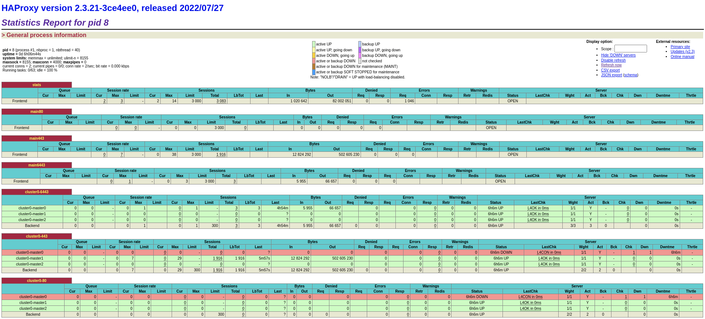

# Configure a reverse proxy to enable the connectivity between an IPv4 host to an IPv6 cluster

## Use case
We have a host configured with IPv4 only interfaces and we need to connect to another cluster/host configured with IPv6 only interfaces.


## Solution
Implement a HAProxy solution, deploying it as a container. Can be configured as a service in the IPv4 host, but this is out of the scope for this document.

The proxy will be listening at some ports and depending in our configuration, will redirect the received traffic from **IPv4** to the desired **IPv6** configured hosts.

_After the implementation of this solution, the available Cluster's hosts IPv6 subnet will be reachable from the other host IPv4 subnet._


## Configuration file
* To provide the proxy we need to include some configuration located at the **haproxy.cfg** configuration file.
* This configuration file can be placed by default at this path:
```/etc/haproxy/haproxy.cfg```

### global
This section defines global parameters that will apply to the whole configuration.

_Copy like this, nothing needs to be modified._
```
global
    log 127.0.0.1 local0 
    chroot      /var/lib/haproxy
    pidfile     /var/run/haproxy.pid
    maxconn     4000
    user        haproxy
    group       haproxy
    daemon
    stats socket /var/lib/haproxy/stats
    ssl-default-bind-ciphers PROFILE=SYSTEM
    ssl-default-server-ciphers PROFILE=SYSTEM
```

### defaults
This section sets default values for some connection related parameters.

_Copy like this, nothing needs to be modified._
```
defaults
    log                     global
    option                  httplog
    option                  dontlognull
    option http-server-close
    option forwardfor       except 127.0.0.0/8
    option                  redispatch
    retries                 3
    timeout http-request    10s
    timeout queue           1m
    timeout connect         10s
    timeout client          1m
    timeout server          1m
    timeout http-keep-alive 10s
    timeout check           10s
    maxconn                 3000
```

### frontend (stats)
This section defines relevant parameters related to the web stats interface (see below).

<ins>Relevant parameters:</ins>
* the proxy will be listening at port **50.000** for **IPv4** traffic.
* stats dashboard will be available on **/stats**.
* user/password to grant access to the web interface.
```
frontend stats 
    bind *:50000
    stats enable
    stats uri /stats
    stats auth admin:password
    stats refresh 10s
    mode http
```

### frontend
This section links the frontend configuration with the backend configuration.

_Repeat this section for each configured listening port: **80** (http), **443** (https), **6443** (ocp)._

<ins>Relevant parameters:</ins>
* the proxy will be listening at port **6443** for **IPv4** traffic.
* the requests made to **cluster-name** (ocp-disconnected.fede.IPv6.lab) will be redirected to what is related to the **is_cluster0** label.
* the backend **cluster0-6443** label will be linked with the **is_cluster0** label.
```
frontend main6443
    bind *:6443
    mode tcp
    tcp-request inspect-delay 3s
    tcp-request content capture req.ssl_sni len 100
    log-format "capture0: %[capture.req.hdr(0)]"
    acl is_cluster0 req.ssl_sni -m reg ocp-disconnected.fede.IPv6.lab
    use_backend cluster0-6443 if is_cluster0
    default_backend cluster0-6443
```

### backend
This section includes the hosts that will receive the requests forwarded to IPv6.

_Repeat this section for each configured listening port: **80** (http), **443** (https), **6443** (ocp)._

<ins>Relevant parameters:</ins>
* **balance:** source --> means that if one client request was forwarded to cluster0-master0, next request from the same client will be forwarded to the same host until the host will be unavailable.
* **mode**: tcp --> can have tcp or http values.
* Add one **server** row for every host included in the cluster.
```
backend cluster0-6443
    balance source
    mode tcp
    server cluster0-master0 2620:52:0:1305::100:6443 check sni req.ssl_sni
    server cluster0-master1 2620:52:0:1305::101:6443 check sni req.ssl_sni
    server cluster0-master2 2620:52:0:1305::102:6443 check sni req.ssl_sni
```


## Create the HAProxy container
Execute the following command to deploy the HAProxy container named **haproxy**, that will perform the reverse proxy role.

```
podman run -d --name haproxy --rm --network host -v /etc/haproxy/haproxy.cfg:/usr/local/etc/haproxy/haproxy.cfg:z docker.io/library/haproxy:2.3
```

<ins>Podman arguments:</ins>
* -d (detach) --> run in background.
* --name --> new container's name.
* rm -->  automatically remove the container when already exist.
* --network --> **host** means that the container will not create a network namespace, instead of this the container will use the host's network.
* -v (volume) --> create a bind-mount. configuration file path (host) : configuration file path (container) : (z) the host and the container share the volumen content.
* image-name to be used to create the container: image-version.


If we check the containers, the deployed haproxy container will look like this:


## HAProxy stats dashboard
HAProxy service has a web interface where you can check the traffic stats/data received by the host, available on the link below:

[http://\<cluster-api-ip-address>\:50000/stats](http://<cluster-api-ip-address>:50000/stats)


The stats interface (for HAProxy version 2.3) looks like this:

